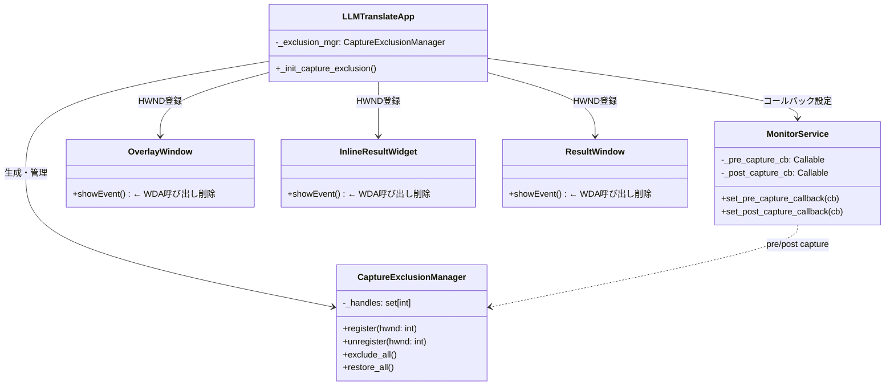
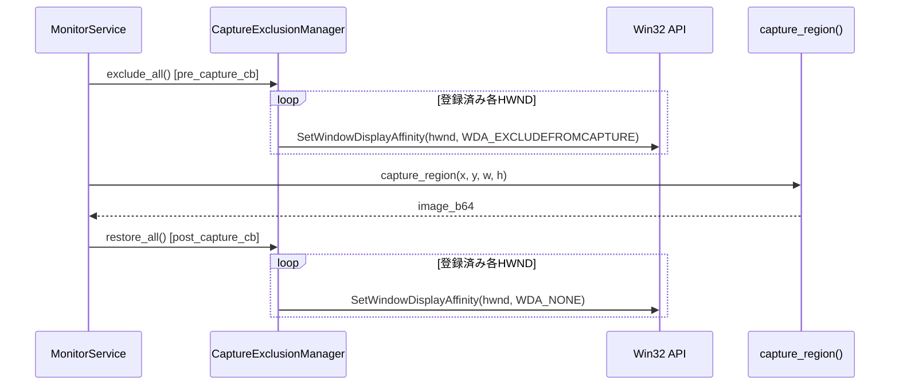

# Design Document: Dynamic Capture Exclusion

## Overview

LLMTranslate のオーバーレイウィンドウ群（OverlayWindow, InlineResultWidget, ResultWindow）は、翻訳キャプチャへの映り込み防止のため `SetWindowDisplayAffinity(WDA_EXCLUDEFROMCAPTURE)` を使用している。現状は各ウィンドウの `showEvent` で常時キャプチャ除外を適用しているため、Snipping Tool 等の通常スクリーンショットにも映らない。

本設計では、翻訳キャプチャの直前・直後にのみ WDA 状態を動的に切り替える `CaptureExclusionManager` を導入し、通常時はウィンドウが Snipping Tool 等で映る状態を維持する。

### 設計方針

- `CaptureExclusionManager` を `src/core/platform.py` に追加し、ウィンドウ HWND のレジストリと一括切り替え機能を提供する
- 既存の `MonitorService._pre_capture_cb` / `_post_capture_cb` コールバック機構を活用し、キャプチャ前後で WDA 状態を切り替える
- 各ウィンドウの `showEvent` から `apply_wda_exclude_from_capture` 呼び出しを削除し、常時除外を廃止する
- `app.py`（GUI 層）で `CaptureExclusionManager` を生成し、各ウィンドウの HWND を登録、MonitorService のコールバックに接続する
- Win32 API 呼び出しの失敗はログ出力のみで継続し、アプリケーションをクラッシュさせない

## Architecture

### コンポーネント構成



### キャプチャ前後のシーケンス



### 既存コールバック機構の活用

`MonitorService._do_translate()` は既に try/finally パターンで `_pre_capture_cb` / `_post_capture_cb` を呼び出している。キャプチャ中に例外が発生しても `finally` ブロックで `restore_all()` が確実に呼ばれるため、WDA_NONE への復帰が保証される。

```python
# MonitorService._do_translate() 既存コード（変更不要）
try:
    if self._pre_capture_cb:
        self._pre_capture_cb()
    try:
        image_b64 = capture_region(x, y, w, h, hide_widget=None)
    finally:
        if self._post_capture_cb:
            self._post_capture_cb()
except Exception as e:
    ...
```

## Components and Interfaces

### 1. CaptureExclusionManager（新規）

`src/core/platform.py` に追加するクラス。ウィンドウ HWND のレジストリを管理し、一括で WDA 状態を切り替える。

```python
class CaptureExclusionManager:
    """キャプチャ前後で Overlay Windows の WDA 状態を一括切り替えする管理クラス"""

    def __init__(self) -> None:
        self._handles: set[int] = set()

    def register(self, hwnd: int) -> None:
        """ウィンドウハンドルを登録"""
        self._handles.add(hwnd)

    def unregister(self, hwnd: int) -> None:
        """ウィンドウハンドルを登録解除"""
        self._handles.discard(hwnd)

    def exclude_all(self) -> None:
        """全登録ウィンドウを WDA_EXCLUDEFROMCAPTURE に設定"""
        for hwnd in self._handles:
            _set_window_display_affinity(hwnd, _WDA_EXCLUDEFROMCAPTURE)

    def restore_all(self) -> None:
        """全登録ウィンドウを WDA_NONE に設定（通常表示に復帰）"""
        for hwnd in self._handles:
            _set_window_display_affinity(hwnd, _WDA_NONE)
```

### 2. 低レベル WDA 関数（新規）

既存の `apply_wda_exclude_from_capture` を汎用化した内部関数。

```python
# 定数
_WDA_NONE = 0x00
_WDA_EXCLUDEFROMCAPTURE = 0x11

def _set_window_display_affinity(hwnd: int, affinity: int) -> None:
    """SetWindowDisplayAffinity を呼び出す低レベル関数"""
    if sys.platform != "win32":
        return
    try:
        import ctypes
        result = ctypes.windll.user32.SetWindowDisplayAffinity(hwnd, affinity)
        if not result:
            logger.warning("SetWindowDisplayAffinity 失敗: hwnd=%s, affinity=0x%02X", hwnd, affinity)
    except Exception as e:
        logger.error("SetWindowDisplayAffinity 例外: hwnd=%s, error=%s", hwnd, e)
```

### 3. 既存関数の変更

`apply_wda_exclude_from_capture` は後方互換のため残すが、内部実装を `_set_window_display_affinity` に委譲する。

```python
def apply_wda_exclude_from_capture(hwnd: int) -> None:
    """後方互換: スクリーンキャプチャからウィンドウを除外"""
    _set_window_display_affinity(hwnd, _WDA_EXCLUDEFROMCAPTURE)
```

### 4. showEvent の変更

3 つのウィンドウクラスの `showEvent` から `apply_wda_exclude_from_capture` 呼び出しを削除する。

**OverlayWindow.showEvent:**
```python
def showEvent(self, event) -> None:
    super().showEvent(event)
    _apply_dwm_no_border(int(self.winId()))
    # apply_wda_exclude_from_capture 呼び出しを削除
    self._auto_hide.on_show_or_reposition()
```

**InlineResultWidget.showEvent:**
```python
def showEvent(self, event) -> None:
    super().showEvent(event)
    _apply_dwm_no_border(int(self.winId()))
    # apply_wda_exclude_from_capture 呼び出しを削除
```

**ResultWindow.showEvent:**
```python
def showEvent(self, event) -> None:
    super().showEvent(event)
    # apply_wda_exclude_from_capture 呼び出しを削除
```

### 5. LLMTranslateApp での統合

`app.py` で `CaptureExclusionManager` を生成し、各ウィンドウの HWND を登録、MonitorService のコールバックに接続する。

```python
class LLMTranslateApp:
    def __init__(self, config: ConfigManager) -> None:
        # ... 既存の初期化 ...
        self._exclusion_mgr = CaptureExclusionManager()

        # UIコンポーネント初期化後にHWND登録
        self._init_overlay()
        self._init_result_window()
        self._init_capture_exclusion()
        # ...

    def _init_capture_exclusion(self) -> None:
        """キャプチャ除外マネージャの初期化とコールバック接続"""
        # OverlayWindow の HWND 登録
        self._exclusion_mgr.register(int(self._overlay.winId()))

        # ResultWindow の HWND 登録
        self._exclusion_mgr.register(int(self._result.winId()))

        # MonitorService のコールバックに接続
        self._service.monitor.set_pre_capture_callback(self._exclusion_mgr.exclude_all)
        self._service.monitor.set_post_capture_callback(self._exclusion_mgr.restore_all)
```

**InlineResultWidget の登録タイミング:**
InlineResultWidget は `enable_inline_result()` で動的に生成されるため、生成時に HWND を登録する。`_apply_display_mode()` 内で InlineResultWidget が生成された後に登録を行う。

```python
def _apply_display_mode(self, mode: str | None = None) -> None:
    # ... 既存のモード切替ロジック ...
    if is_inline:
        self._overlay.enable_inline_result(...)
        widget = self._overlay.get_inline_widget()
        if widget:
            self._exclusion_mgr.register(int(widget.winId()))
    # ...
```

## Data Models

### CaptureExclusionManager 内部状態

```python
class CaptureExclusionManager:
    _handles: set[int]    # 登録済みウィンドウハンドルの集合
```

- `set` を使用することで、同一 HWND の重複登録を自動的に防止
- `discard` を使用することで、未登録 HWND の解除時にエラーを発生させない

### WDA 定数

| 定数 | 値 | 用途 |
|------|-----|------|
| `_WDA_NONE` | `0x00` | 通常表示（キャプチャに映る） |
| `_WDA_EXCLUDEFROMCAPTURE` | `0x11` | キャプチャ除外（キャプチャに映らない） |

### 状態遷移

各ウィンドウの WDA 状態は以下の 2 値間を遷移する:

```
通常時:        WDA_NONE（Snipping Tool 等で映る）
キャプチャ中:  WDA_EXCLUDEFROMCAPTURE（翻訳キャプチャに映らない）
```

従来（常時 `WDA_EXCLUDEFROMCAPTURE`）と異なり、デフォルト状態が `WDA_NONE` になる。


## Correctness Properties

*A property is a characteristic or behavior that should hold true across all valid executions of a system — essentially, a formal statement about what the system should do. Properties serve as the bridge between human-readable specifications and machine-verifiable correctness guarantees.*

### Property 1: レジストリ整合性

*For any* sequence of `register` and `unregister` operations with arbitrary integer HWND values, the set of tracked handles SHALL exactly equal the set of HWNDs that have been registered but not subsequently unregistered. Specifically:
- After `register(hwnd)`, `hwnd` is in the tracked set
- After `unregister(hwnd)`, `hwnd` is not in the tracked set
- Duplicate `register` calls with the same HWND do not create duplicates
- `unregister` of a non-registered HWND does not raise an error

**Validates: Requirements 2.1, 2.2, 2.3, 2.4**

### Property 2: 一括切り替えの完全性

*For any* set of registered HWNDs (including the empty set), `exclude_all()` SHALL invoke the low-level WDA function with `WDA_EXCLUDEFROMCAPTURE` for exactly the set of currently registered HWNDs, and `restore_all()` SHALL invoke it with `WDA_NONE` for exactly the same set. The set of HWNDs passed to the low-level function SHALL equal the set of registered HWNDs — no more, no less.

**Validates: Requirements 3.1, 3.2, 4.1, 4.3, 7.3**

### Property 3: エラー耐性（restore_all）

*For any* set of registered HWNDs and *for any* subset of those HWNDs that cause the low-level WDA function to fail, `restore_all()` SHALL still attempt to call the low-level function for every registered HWND. The set of attempted HWNDs SHALL equal the full set of registered HWNDs, regardless of which individual calls fail.

**Validates: Requirements 4.2**

## Error Handling

### _set_window_display_affinity

| エラー状況 | 対処 |
|-----------|------|
| `sys.platform != "win32"` | 何もせず return（ログなし） |
| `ctypes.windll.user32.SetWindowDisplayAffinity` が 0 を返す | `logger.warning` でログ出力、例外は発生させない |
| `ctypes` インポートや API 呼び出しで例外発生 | `logger.error` でログ出力、例外を握りつぶして継続 |

### CaptureExclusionManager.exclude_all / restore_all

| エラー状況 | 対処 |
|-----------|------|
| 登録ウィンドウが 0 件 | 何もせず正常終了 |
| 1 つの HWND で `_set_window_display_affinity` が失敗 | 残りの HWND の処理を継続（`_set_window_display_affinity` 内部でエラーを吸収） |
| 無効な HWND（ウィンドウ破棄済み等） | Win32 API が失敗を返すが、上記のエラーハンドリングで吸収 |

### MonitorService コールバック

| エラー状況 | 対処 |
|-----------|------|
| `pre_capture_cb` で例外発生 | 外側の try/except でキャッチ、`translation_error` シグナル発行 |
| `capture_region` で例外発生 | finally ブロックで `post_capture_cb`（restore_all）が確実に呼ばれる |
| `post_capture_cb` で例外発生 | `_set_window_display_affinity` 内部でエラーを吸収するため、`restore_all` 自体は例外を投げない |

## Testing Strategy

### テストフレームワーク

- **ユニットテスト**: pytest
- **プロパティベーステスト**: Hypothesis（Python 向け PBT ライブラリ、プロジェクトで既に使用中）
- **モック**: `unittest.mock`（Win32 API 呼び出しのモック）

### プロパティベーステスト

本機能の `CaptureExclusionManager` は純粋なレジストリ管理ロジック（set 操作 + イテレーション）を含むため、PBT が適用可能。

**設定:**
- 各プロパティテストは最低 100 イテレーション
- 各テストにはデザインドキュメントのプロパティ番号をタグ付け
- タグ形式: `Feature: dynamic-capture-exclusion, Property {number}: {property_text}`

**テスト対象と戦略:**

| プロパティ | テスト内容 | 生成戦略 |
|-----------|-----------|---------|
| Property 1 | register/unregister 操作列後のレジストリ状態 | `st.lists(st.tuples(st.sampled_from(["register", "unregister"]), st.integers(1, 1000)))` で操作列を生成 |
| Property 2 | exclude_all/restore_all が全登録 HWND を処理 | `st.sets(st.integers(1, 1000))` で HWND セットを生成、モックで呼び出し引数を検証 |
| Property 3 | 一部 HWND 失敗時も全 HWND に対して呼び出し | `st.sets(st.integers(1, 1000), min_size=1)` + 失敗 HWND のサブセットを生成 |

### ユニットテスト（例ベース）

| テスト対象 | テスト内容 | 対応要件 |
|-----------|-----------|---------|
| `_set_window_display_affinity` | 非 Windows 環境でスキップ | 1.3 |
| `_set_window_display_affinity` | API 失敗時にログ出力・例外なし | 1.4 |
| `exclude_all` | 空レジストリで正常終了 | 3.2 |
| `restore_all` | 空レジストリで正常終了 | 4.3 |
| `OverlayWindow.showEvent` | `apply_wda_exclude_from_capture` が呼ばれない | 5.1, 5.2 |
| `InlineResultWidget.showEvent` | `apply_wda_exclude_from_capture` が呼ばれない | 5.1, 5.2 |
| `ResultWindow.showEvent` | `apply_wda_exclude_from_capture` が呼ばれない | 5.1, 5.2 |

### 統合テスト

| テスト対象 | テスト内容 | 対応要件 |
|-----------|-----------|---------|
| MonitorService + CaptureExclusionManager | pre_capture_cb で exclude_all が呼ばれる | 6.1, 7.1 |
| MonitorService + CaptureExclusionManager | post_capture_cb で restore_all が呼ばれる | 6.2, 7.2 |
| MonitorService 例外時 | capture_region 例外時も post_capture_cb が呼ばれる | 6.3 |
| MonitorService.translate_once | 手動翻訳でも pre/post コールバックが呼ばれる | 6.4 |

### テストファイル構成

```
tests/
  test_capture_exclusion.py   # CaptureExclusionManager のユニット + PBT（新規）
  test_app_service.py         # 統合テスト追加（既存ファイルに追加）
```
