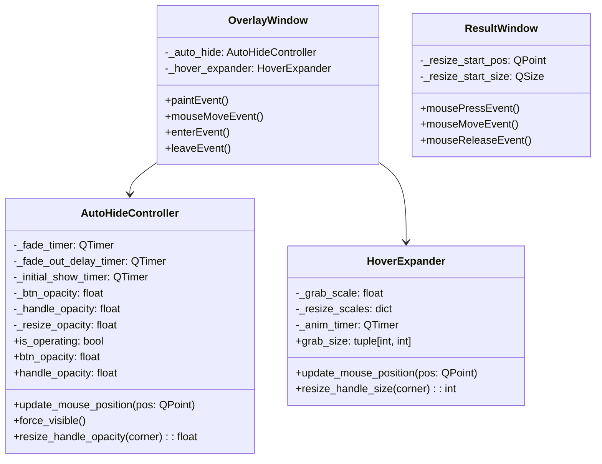
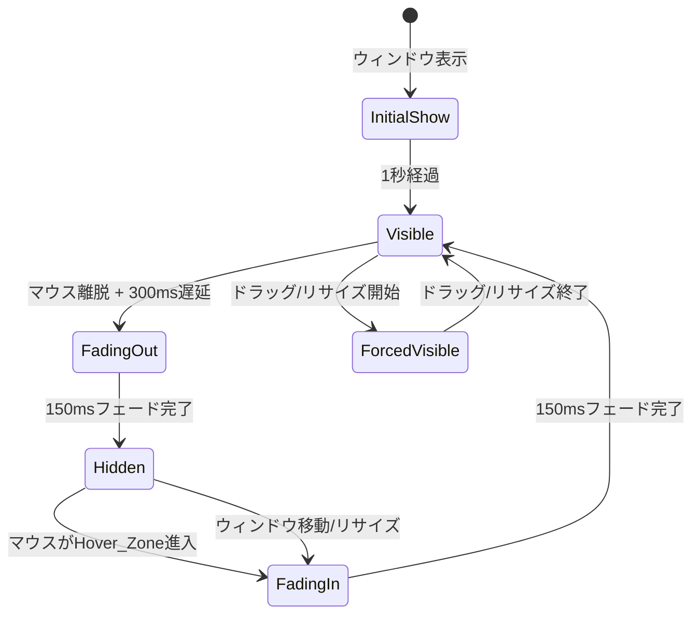

# Design Document: Overlay UX Improvements

## Overview

LLMTranslate のオーバーレイ UI を改善し、ユーザーの主要コンテンツを妨げないモダンなインターフェースを実現する。本設計は以下の 3 領域をカバーする:

1. **UI 要素の自動非表示** — ボタンパネル・グラブハンドル・リサイズハンドルをマウス離脱時にフェードアウトし、ホバー時にフェードインする
2. **ResultWindow リサイズバグ修正** — `mouseMoveEvent` でのサイズ計算を初期位置ベースに修正し、加速・ジャンプを解消する
3. **欠落翻訳キー追加** — `result.cancelled` キーを全 10 言語ファイルに追加する

### 設計方針

- 既存の `paintEvent` ベースのカスタム描画アーキテクチャを維持する
- 自動非表示は `paintEvent` 内で各要素の不透明度（alpha 値）を制御する方式で実装する
- アニメーションは `QTimer` ベースの線形補間で実装し、外部ライブラリに依存しない
- 既存のヒットテスト (`_hit_test`) ロジックへの変更を最小限に抑える

## Architecture

### コンポーネント構成



### 状態遷移（自動非表示）



## Components and Interfaces

### 1. AutoHideController

`OverlayWindow` 内部に組み込むコントローラクラス。マウス位置に基づいて各 UI 要素の不透明度を管理する。

```python
class AutoHideController:
    """UI要素の自動非表示を制御するコントローラ"""

    # タイミング定数
    FADE_DURATION_MS = 150       # フェードイン/アウトの所要時間
    FADE_OUT_DELAY_MS = 300      # マウス離脱後のフェードアウト開始遅延
    INITIAL_SHOW_MS = 1000       # 初期表示の維持時間
    TICK_INTERVAL_MS = 16        # アニメーションティック間隔（≈60fps）

    def __init__(self, overlay: OverlayWindow) -> None: ...

    # --- 公開プロパティ ---
    @property
    def btn_opacity(self) -> float:
        """ボタンパネルの現在の不透明度 (0.0〜1.0)"""

    @property
    def grab_handle_opacity(self) -> float:
        """グラブハンドルの現在の不透明度 (0.0〜1.0)"""

    def resize_handle_opacity(self, corner_index: int) -> float:
        """指定コーナーのリサイズハンドル不透明度 (0.0〜1.0)"""

    # --- 制御メソッド ---
    def update_mouse_position(self, local_pos: QPoint) -> None:
        """マウス位置を受け取り、Hover_Zone判定を行う"""

    def on_mouse_leave(self) -> None:
        """マウスがウィンドウ外に出た時の処理"""

    def on_mouse_enter(self) -> None:
        """マウスがウィンドウ内に入った時の処理"""

    def force_visible(self) -> None:
        """全要素を即座に表示（ドラッグ/リサイズ中、初期表示時）"""

    def on_show_or_reposition(self) -> None:
        """ウィンドウ表示/移動時に1秒間表示を維持"""

    def set_operating(self, operating: bool) -> None:
        """ドラッグ/リサイズ操作中フラグの設定"""
```

**Hover Zone 定義:**
- **ボタンパネル**: フレーム右辺から右方向に `_BTN_PANEL_W + 10px` の領域（ボタンパネル幅 + 余白）
- **グラブハンドル**: フレーム上辺から上方向に `_GRAB_H + 15px` の領域
- **リサイズハンドル**: 各コーナーから `15px` 半径の円形領域

### 2. HoverExpander

ホバー時のサイズ拡大アニメーションを管理する。

```python
class HoverExpander:
    """ハンドルのホバー拡大アニメーションを管理"""

    EXPAND_DURATION_MS = 100     # 拡大/縮小の所要時間
    TICK_INTERVAL_MS = 16        # アニメーションティック間隔

    # グラブハンドルのサイズ範囲
    GRAB_DEFAULT = (36, 5)       # デフォルト: _GRAB_W × _GRAB_H
    GRAB_EXPANDED = (60, 10)     # 拡大時

    # リサイズハンドルのサイズ範囲
    RESIZE_DEFAULT = 5           # デフォルト: HANDLE_SIZE
    RESIZE_EXPANDED = 10         # 拡大時

    def __init__(self) -> None: ...

    def update_mouse_position(self, local_pos: QPoint, frame_rect: QRect) -> None:
        """マウス位置に基づいてホバー状態を更新"""

    @property
    def grab_width(self) -> float:
        """現在のグラブハンドル幅（補間値）"""

    @property
    def grab_height(self) -> float:
        """現在のグラブハンドル高さ（補間値）"""

    def resize_handle_size(self, corner_index: int) -> float:
        """指定コーナーのリサイズハンドルサイズ（補間値）"""

    @property
    def needs_repaint(self) -> bool:
        """アニメーション中で再描画が必要かどうか"""
```

**補間方式:**
- ease-out 補間: `t = 1 - (1 - linear_t) ** 2` で自然な減速感を実現
- グラブハンドルは幅・高さを独立に補間
- リサイズハンドルは正方形サイズを単一値で補間

### 3. paintEvent の変更

既存の `paintEvent` を拡張し、各要素の描画時に `AutoHideController` と `HoverExpander` から取得した不透明度・サイズを適用する。

```python
def paintEvent(self, event):
    painter = QPainter(self)
    # ... フレーム枠線描画（常に表示）...

    # グラブハンドル描画（不透明度 + サイズ適用）
    grab_opacity = self._auto_hide.grab_handle_opacity
    if grab_opacity > 0.01:
        gw = self._hover_expander.grab_width
        gh = self._hover_expander.grab_height
        handle_color = QColor(self._border_color)
        handle_color.setAlpha(int(180 * grab_opacity))
        painter.setBrush(handle_color)
        painter.setPen(Qt.NoPen)
        gh_x = m + (frame_w - gw) / 2
        painter.drawRoundedRect(QRectF(gh_x, m - gh, gw, gh), 2, 2)

    # ボタンパネル描画（不透明度適用）
    btn_opacity = self._auto_hide.btn_opacity
    if btn_opacity > 0.01:
        painter.setOpacity(btn_opacity)
        # ... 既存のボタン描画ロジック ...
        painter.setOpacity(1.0)

    # リサイズハンドル描画（不透明度 + サイズ適用）
    for i, corner in enumerate(corners):
        opacity = self._auto_hide.resize_handle_opacity(i)
        if opacity > 0.01:
            hs = self._hover_expander.resize_handle_size(i)
            handle_color = QColor(self._border_color)
            handle_color.setAlpha(int(180 * opacity))
            # ... コーナー位置にサイズ hs で描画 ...
```

### 4. ResultWindow リサイズ修正

`mousePressEvent` でドラッグ開始時の初期位置と初期サイズを記録し、`mouseMoveEvent` では初期値からのデルタで新サイズを計算する。

```python
# mousePressEvent で記録
self._resize_start_pos = event.globalPosition().toPoint()
self._resize_start_size = self.size()

# mouseMoveEvent で計算
delta = event.globalPosition().toPoint() - self._resize_start_pos
new_w = max(MIN_WIN_SIZE.width(), self._resize_start_size.width() + delta.x())
new_h = max(MIN_WIN_SIZE.height(), self._resize_start_size.height() + delta.y())
self.resize(new_w, new_h)
```

### 5. 翻訳キー追加

`result.cancelled` キーを全 10 言語ファイルに追加:

| 言語 | 値 |
|------|-----|
| en | Cancelled |
| ja | キャンセル |
| fr | Annulé |
| de | Abgebrochen |
| th | ยกเลิกแล้ว |
| zh_CN | 已取消 |
| zh_TW | 已取消 |
| pt_BR | Cancelado |
| es_419 | Cancelado |
| ko | 취소됨 |

## Data Models

### AutoHideController 内部状態

```python
@dataclass
class _FadeState:
    """各UI要素のフェード状態"""
    current_opacity: float = 1.0    # 現在の不透明度 (0.0〜1.0)
    target_opacity: float = 1.0     # 目標不透明度
    velocity: float = 0.0           # 不透明度変化速度 (per tick)

# コントローラが保持する状態
_btn_fade: _FadeState              # ボタンパネル
_grab_fade: _FadeState             # グラブハンドル
_resize_fades: list[_FadeState]    # リサイズハンドル×4（TL, TR, BL, BR）
_is_operating: bool                # ドラッグ/リサイズ操作中フラグ
_is_initial_show: bool             # 初期表示中フラグ
_mouse_inside: bool                # マウスがウィンドウ内にあるか
```

### HoverExpander 内部状態

```python
@dataclass
class _ScaleState:
    """サイズ補間状態"""
    current: float = 0.0    # 現在の補間値 (0.0=default, 1.0=expanded)
    target: float = 0.0     # 目標補間値
    velocity: float = 0.0   # 変化速度 (per tick)

# エクスパンダが保持する状態
_grab_scale: _ScaleState           # グラブハンドルの拡大率
_resize_scales: list[_ScaleState]  # リサイズハンドル×4の拡大率
```

### ResultWindow リサイズ状態（修正後）

```python
# 既存フィールドの修正
_resize_start_pos: QPoint | None = None    # ドラッグ開始時のグローバルマウス位置
_resize_start_size: QSize | None = None    # ドラッグ開始時のウィンドウサイズ
_resize_edge: Qt.Edge = Qt.Edge(0)         # リサイズ方向（既存）
```

### 定数の追加・変更

| 定数 | 値 | 用途 |
|------|-----|------|
| `_GRAB_W_EXPANDED` | 60 | グラブハンドル拡大時の幅 |
| `_GRAB_H_EXPANDED` | 10 | グラブハンドル拡大時の高さ |
| `_RESIZE_SIZE_EXPANDED` | 10 | リサイズハンドル拡大時のサイズ |
| `_HOVER_DISTANCE` | 15 | ホバー検出距離（px） |
| `_FADE_DURATION_MS` | 150 | フェードアニメーション時間 |
| `_FADE_OUT_DELAY_MS` | 300 | フェードアウト開始遅延 |
| `_INITIAL_SHOW_MS` | 1000 | 初期表示維持時間 |
| `_EXPAND_DURATION_MS` | 100 | ホバー拡大アニメーション時間 |


## Correctness Properties

*A property is a characteristic or behavior that should hold true across all valid executions of a system — essentially, a formal statement about what the system should do. Properties serve as the bridge between human-readable specifications and machine-verifiable correctness guarantees.*

### Property 1: Mouse outside boundary hides all elements

*For any* overlay window geometry and *for any* mouse position that lies outside the overlay window boundary, the AutoHideController SHALL set the target opacity of all UI elements (button panel, grab handle, and all four resize handles) to 0.

**Validates: Requirements 1.1, 2.1, 3.1**

### Property 2: Hover zone detection shows corresponding element

*For any* overlay window geometry and *for any* mouse position that lies within a defined hover zone, the AutoHideController SHALL set the target opacity of the corresponding UI element to 1. Specifically:
- Position in the right-edge hover zone → button panel target opacity = 1
- Position in the top-edge hover zone → grab handle target opacity = 1
- Position near a corner → corresponding resize handle target opacity = 1

**Validates: Requirements 1.2, 2.2, 3.2**

### Property 3: Operating flag forces all elements visible

*For any* mouse position (inside or outside the overlay boundary), while the `is_operating` flag is `True`, the AutoHideController SHALL maintain all UI element opacities at 1.0.

**Validates: Requirements 1.6**

### Property 4: Distance-based hover expansion

*For any* overlay window geometry and *for any* mouse position, the HoverExpander SHALL set the expansion target of a handle to 1.0 (expanded) if and only if the distance from the mouse position to the handle's center is less than or equal to 15 pixels. Otherwise, the expansion target SHALL be 0.0 (default size).

**Validates: Requirements 2.3, 2.4, 3.5, 3.6**

### Property 5: Ease-out interpolation is monotonic and bounded

*For any* input value `t` in the range [0.0, 1.0], the ease-out interpolation function SHALL produce an output in [0.0, 1.0], and *for any* two inputs `t1 ≤ t2`, `ease_out(t1) ≤ ease_out(t2)` (monotonically non-decreasing).

**Validates: Requirements 2.5**

### Property 6: Resize delta is linear and clamped

*For any* initial window size (width ≥ 250, height ≥ 200), *for any* initial mouse position, and *for any* current mouse position during a resize drag, the new window size SHALL equal `max(initial_size + (current_pos - initial_pos), minimum_size)` where minimum_size is (250, 200). The size change SHALL be exactly equal to the mouse movement delta, clamped to the minimum.

**Validates: Requirements 4.2, 4.3, 4.5**

## Error Handling

### AutoHideController

| エラー状況 | 対処 |
|-----------|------|
| `paintEvent` 中に不透明度が NaN/Inf | `max(0.0, min(1.0, value))` でクランプ |
| QTimer コールバック中の例外 | try/except でキャッチし、ログ出力後にタイマー停止 |
| ウィンドウ破棄後のタイマー発火 | `isVisible()` チェックでガード |

### HoverExpander

| エラー状況 | 対処 |
|-----------|------|
| 不正なコーナーインデックス | 範囲チェック（0〜3）、範囲外は HANDLE_SIZE を返す |
| 補間値が [0,1] 範囲外 | クランプ処理 |

### ResultWindow リサイズ

| エラー状況 | 対処 |
|-----------|------|
| `_resize_start_pos` が None のまま `mouseMoveEvent` | None チェックで早期リターン |
| 最小サイズ以下へのリサイズ | `max()` でクランプ（既存動作を維持） |

### 翻訳キー

| エラー状況 | 対処 |
|-----------|------|
| `result.cancelled` キーが未定義の言語 | `I18nManager` の既存フォールバック機構（英語にフォールバック）で対応 |

## Testing Strategy

### テストフレームワーク

- **ユニットテスト**: pytest
- **プロパティベーステスト**: Hypothesis（Python 向け PBT ライブラリ）
- **非同期テスト**: pytest-asyncio（既存テストとの一貫性）

### プロパティベーステスト

本機能には純粋な計算ロジック（座標判定、補間関数、リサイズ計算）が含まれるため、PBT が適用可能。

**設定:**
- 各プロパティテストは最低 100 イテレーション
- 各テストにはデザインドキュメントのプロパティ番号をタグ付け
- タグ形式: `Feature: overlay-ux-improvements, Property {number}: {property_text}`

**テスト対象と戦略:**

| プロパティ | テスト内容 | 生成戦略 |
|-----------|-----------|---------|
| Property 1 | 境界外マウス位置 → 全要素非表示 | `st.integers` でウィンドウ外座標を生成 |
| Property 2 | Hover Zone 内位置 → 対応要素表示 | 各 Hover Zone 内の座標を生成 |
| Property 3 | 操作中フラグ → 全要素表示 | 任意の座標 + `is_operating=True` |
| Property 4 | 距離ベースのホバー拡大 | 任意の座標とハンドル中心の距離を生成 |
| Property 5 | ease-out 補間の単調性・有界性 | `st.floats(0.0, 1.0)` で入力値を生成 |
| Property 6 | リサイズデルタの線形性 | 初期サイズ・初期位置・現在位置を生成 |

### ユニットテスト（例ベース）

| テスト対象 | テスト内容 |
|-----------|-----------|
| AutoHideController タイミング | フェード速度が 150ms で完了する値か検証 (1.3) |
| フェードアウト遅延 | マウス離脱後 300ms 遅延の検証 (1.4) |
| 初期表示維持 | `on_show_or_reposition` 後 1 秒間表示維持 (1.5) |
| タイミング一貫性 | リサイズハンドルとボタンパネルのタイミング定数一致 (3.3) |
| ドラッグ状態記録 | `mousePressEvent` で初期位置・サイズ記録 (4.1) |
| ドラッグ状態リセット | `mouseReleaseEvent` で状態クリア (4.4) |
| 翻訳キー存在 | 全 10 言語で `result.cancelled` が非空文字列 (5.1, 5.4) |
| キー命名規則 | `result.cancelled` が `result.*` 名前空間に準拠 (5.3) |

### 統合テスト

| テスト対象 | テスト内容 |
|-----------|-----------|
| キャンセル表示 | 翻訳キャンセル時にローカライズ済みテキスト表示 (5.2) |
| ボタンシグナル | 表示状態でのボタンクリックが正しいシグナル発行 (6.3) |
| キーボードショートカット | 自動非表示中もショートカット応答 (6.5) |

### 回帰テスト

| テスト対象 | テスト内容 |
|-----------|-----------|
| ヒットテスト | グラブハンドル・リサイズハンドル・ボタンの判定が既存通り (6.1, 6.2) |
| キャプチャ除外 | `WDA_EXCLUDEFROMCAPTURE` 属性の設定確認 (6.4) |

### テストファイル構成

```
tests/
  test_auto_hide.py          # AutoHideController のユニット + PBT
  test_hover_expander.py     # HoverExpander のユニット + PBT
  test_result_window.py      # ResultWindow リサイズ修正の PBT + ユニット
  test_i18n.py               # 翻訳キー追加の検証（既存ファイルに追加）
```
